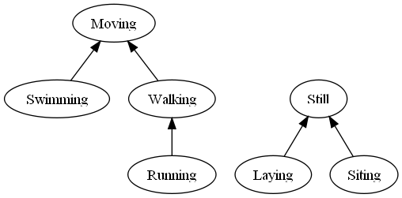

Purpose
=======

Boost.HierarchicalEnum is a library that allows you to add a tree-like relation on the enumerators of a C++ enum.
Once you have defined a HierarchicalEnum, you can use this library to aswers questions like "Is A a descendant of B?" or "What is the nearest common ancester of A and B?"

Important note: this library is <em>candidate</em> to become part of <a>Boost</a>. This documentation and the code are written as if it was already in Boost, only to ease the peer review process, not to pretend that the library has already been accepted.

Quick start
===========

First define your HierarchicalEnum:

    BOOST_HIERARCHICAL_ENUM(
        MovingState,
        (( Still, DEF(), (Laying)(Siting) ))
        (( Laying, DEF(), BOOST_PP_SEQ_NIL ))
        (( Siting, DEF(), BOOST_PP_SEQ_NIL ))
        (( Moving, DEF(), (Walking)(Swimming) ))
        (( Walking, DEF(), (Running) ))
        (( Running, DEF(), BOOST_PP_SEQ_NIL ))
        (( Swimming, DEF(), BOOST_PP_SEQ_NIL ))
    )

This defines a C++ enum named MovingState, and some template specializations to let you use the <a>Boost.HierarchicalEnum functions</a>.
The relationships between the enumerators are as shown in this graph:

Now, you can declare variables of type MovingState:

    MovingState a = Running;
    MovingState b = Swimming;
    MovingState c = Still;
    MovingState d = Moving;

You can then query the library about relationships between those variables:

    namespace bhe = boost::hierarchical_enum;
    bool s = bhe::is_descendant_of( a, c ) // false
    bool t = bhe::is_ascendant_of( d, b ) // true
    MovingState u = bhe::first_common_ascendant_of( a, d ) // Moving

There are also compile-time meta-functions:

    bhe::is_ascendant_of< Running_c, Moving_c >::type // boost::mpl::false_
    bhe::is_child_of< Running_c, Walking_c >::type // boost::mpl::true_
    bhe::children_of< Moving_c >::type // boost::mpl::vector_< Walking_c, Swimming_c >

Misclaneous notes
=================

The current implementation of Boost.HierarchicalEnum is such that all results are pre-computed at compile-time with help of Boost.Mpl, and that run-time versions of the functions are as efficient as a simple switch on the argument, then return a constant.
The trade-off is that compilation time can be quite long, especialy for HierarchicalEnums with many enumerators, due to many template instanciations.
The trick is to encapsulate the calls to this library in your own functions, which are compiled only once in one given translation unit.
It is anyway a good idea to encapsulate this library into functions with names significant for your application domain.
A positive side-effect is that it narrows the wide interface of the library to only the functions which are meaningfull to you.

    // MovingState.hpp
    #include <boost/hierarchical_enum.hpp>

    BOOST_HIERARCHICAL_ENUM( MovingState, ... )
    bool isMoving( MovingState );

x

    // MovingState.cpp
    #include "MovingState.hpp"

    namespace bhe = boost::hierarchical_enum;

    bool isMoving( MovingState m ) {
        return bhe::is_descendant_of< Moving >( m );
    }

This library is candidate to become part of <a>Boost</a>. As such, it's implementation <em>and</em> interface will be subject to as many changes as required by the peer review process.
In any case, the core functionalities will remain, so you are likely to be able to use the next versions, provided that you have encapsulated the calls to Boost.HierarchicalEnum.

As the author of this library, I would be glad to have any kind of feedback from your experience with it.
Be it "it sucks", "it's wonderful", or anything in the middle, with or without detailed explaination of why you think so,
I would be very greatfull if you took time to write a mail, either to the Boost mailing list or to my personnal address. (Prefer the mailing list for detailed critisisms that would help the review process)
Do not hesitate to critisize the documentation, the interface, the implementation and even my english language, since it's not my mother thong. These are all subjects to improvments.

